# PJM System Net Load & Price Analysis

1. [Project Overview](#project-overview)  
2. [Key Findings Summary](#key-findings-summary)  
3. [Data Sources](#data-sources)  
4. [Repository Contents](#repository-contents)  
5. [Environment Setup](#environment-setup)  
6. [Analysis Breakdown](#analysis-breakdown)  
7. [Findings](#findings)

---

## Project Overview
This project rebuilds a conceptually correct PJM-RTO net-load series (RTO load minus total renewable generation), aligns it with PJM’s day-ahead system price, and examines how renewable availability and load cyclicality shape price formation. Earlier analyses mixed regional loads with system-wide renewables and out-of-phase timestamps; the current workflow keeps every series in Eastern Prevailing Time and within the same RTO footprint. The notebook (`energy.ipynb`) performs all cleaning, aggregation, visualization, regression, and commentary, exporting each plot as a PNG plus an accompanying CSV so graphics can be recreated externally.

Net load is the hinge connecting physical operations with economic outcomes. Traders look at it to price spark spreads and congestion risk, utilities rely on it when planning procurement or scheduling outages, and policymakers use it to judge whether new renewable capacity is truly shaving peaks. With that lens the research questions become:
- How do hourly, daily, and seasonal load and renewable profiles interact to produce PJM’s characteristic duck curve, and what does that imply for storage build-out and capacity adequacy?
- At what net-load levels does PJM price move sharply, and how much of that behaviour can a net-load-only model explain before fuel shocks, transmission constraints, or policy actions dominate?
- When do renewables suppress price beyond what net load captures, and where do fuel shortages or extreme weather break that historical relationship?
- How do these dynamics affect households, commercial consumers, and asset owners who ultimately experience the results through utility bills, hedging costs, or infrastructure investment decisions?

## Key Findings Summary
- Net load displays strong intraday and seasonal structure: renewables carve midday troughs yet evening ramps remain the binding stress point, especially in winter and late summer. This informs when peaking assets earn scarcity rents and when storage is most valuable.
- PJM price is convex in net load. Below roughly 110 GW, prices hover near $25–30/MWh; once net load exceeds 125 GW the marginal $/MWh jump accelerates rapidly, which is where uplift payments, scarcity pricing, and demand-response events concentrate.
- Renewable share is inversely related to price. Higher renewable penetration directly lowers clearing prices because fewer gas units set the marginal bid. Consumers benefit through cheaper energy while generators pivot toward capacity payments, renewable credits, or hedging strategies to stabilise revenue.
- The January 2024 Arctic outbreak temporarily broke the historical net-load/price correlation, demonstrating how fuel scarcity and emergency dispatch can override demand fundamentals. EIA recorded a record 141.5 Bcf of U.S. gas demand on 16 January, and PJM experienced the same physical stress through high prices and emergency alerts.
- Polynomial regression (degree 10) captures the flat-to-steep curvature in the price response while leaving interpretable residuals that flag scarcity events or renewable surpluses. Those residuals highlight when price embeds congestion, fuel risk, or policy intervention beyond what load alone predicts.

## Data Sources
All source files reside under `data/` and are provided externally.

| File | Description | Key Fields Used |
| --- | --- | --- |
| `historical_power_load.csv` | PJM forecast load by area, timestamped in UTC/EPT | `forecast_area`, `forecast_hour_beginning_ept`, `forecast_load_mw` |
| `generation_by_source.csv` | Hourly generation by fuel type, with renewable flags | `datetime_beginning_ept`, `fuel_type`, `mw`, `is_renewable` |
| `day_ahead_energy_price.csv` | Day-ahead PJM prices by pnode | `pnode_name`, `system_energy_price_da`, `datetime_beginning_ept` |

## Repository Contents

| Path | Description |
| --- | --- |
| `energy.ipynb` | Primary notebook covering ingestion, processing, plotting, modelling, and narrative commentary. |
| `data/` | Raw CSV inputs described above (not tracked here). |
| `plots/` | Auto-generated PNGs for every figure (ignored by git). |
| `csv_plots/` | CSV snapshots of each plot’s underlying aggregated data (ignored). |
| `output_data/` | Derived tables such as regression diagnostics (ignored). |
| `requirements.txt` | Minimal Python dependency list. |
| `.venv/`, `.ipynb_checkpoints/` | Local environment artefacts (ignored). |

## Environment Setup
1. **Python** – Install Python 3.12 (or later with Matplotlib wheels). macOS users can use `brew install python@3.12`.
2. **Virtual environment** – From the repo root:
   ```bash
   python3 -m venv .venv
   source .venv/bin/activate
   ```
3. **Dependencies** – Install packages:
   ```bash
   pip install --upgrade pip
   pip install -r requirements.txt
   ```
4. **Notebook execution** – Run interactively in Jupyter or headless:
   ```bash
   jupyter nbconvert --to notebook --execute energy.ipynb --output energy.ipynb
   ```
   Executing the notebook refreshes every PNG in `plots/` and exports each plot’s dataset into `csv_plots/`.

## Analysis Breakdown

1. **Dataset hygiene** – Converts all timestamps to EPT, filters load to `forecast_area == "RTO"`, aggregates renewables system-wide, and extracts PJM-RTO price rows only.
2. **Feature engineering** – Adds calendar features (hour, day, month), renewable shares, rolling averages, and rolling standard deviations.
3. **Plotting utilities** – Unified helpers (`save_fig`, `save_plot_data`, `hourly_average_plot`, etc.) ensure every visual/outcome includes a CSV log.
4. **Cyclicality diagnostics** – Hourly/day/month charts for price, renewable mix overlays, and renewable fuel-type cyclicality.
5. **Heatmaps & density** – 24×7 net-load and renewable heatmaps; hexbin density for net load vs price.
6. **Renewable share impact** – Scatter and binned curves linking renewable penetration to price.
7. **Dynamics** – Rolling correlation, trend, and volatility charts to identify when net load and price decouple.
8. **Relationship plots** – Net-load vs price coloured by month/hour/weekday, distribution histograms, and binned averages.
9. **Regression** – Polynomial fits (degrees 1–10) with train/test performance, best-fit overlay, and residual computation.
10. **Residual forensics** – Residuals vs net load, residuals vs renewable MW, extreme-event callouts.
11. **Autocorrelation** – Price and net-load autocorrelation up to 168 hours to bound forecast horizons.

## Findings
Visuals reside in `plots/`. Commentary summarises the behaviour shown by each figure.

### Hourly, Weekly, and Monthly Price Cyclicality
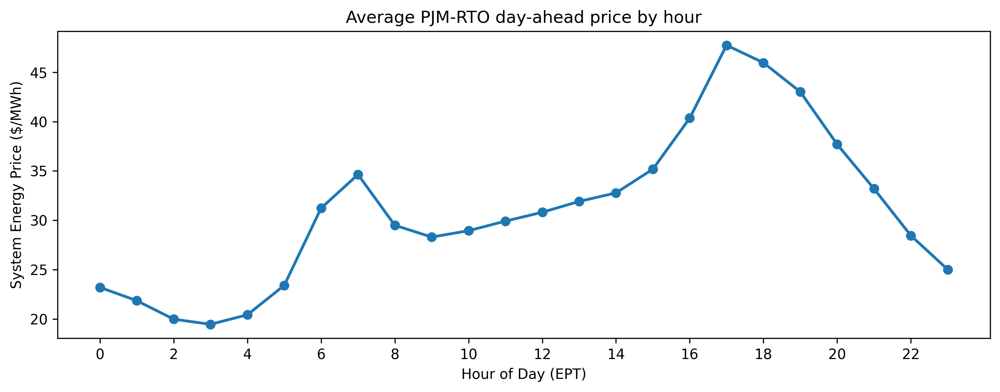
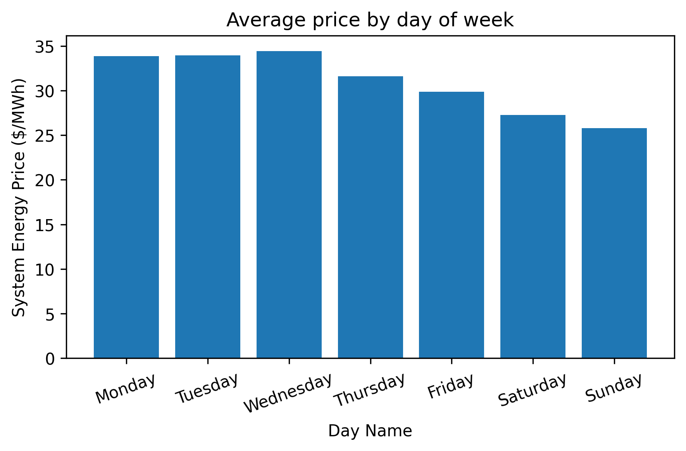
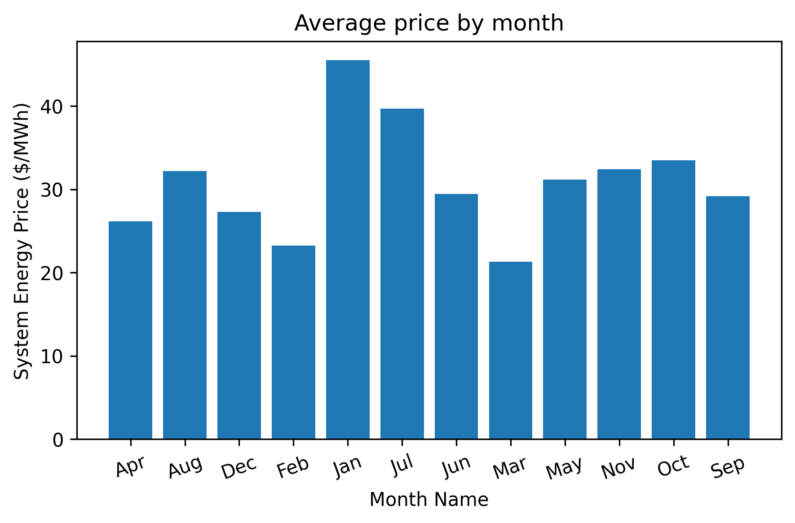
- Hourly prices rise from pre-dawn lows (roughly $25/MWh) into the afternoon as HVAC, commercial, and industrial demand peak; lighting alone cannot explain the swing. This curve dictates when batteries discharge and when demand-response programmes intervene.
- Weekdays command a premium relative to weekends because factories and offices sustain higher base load. Locational marginal price spreads widen during the workweek, which feeds into hedging costs for commercial customers.
- January and July stand out as the most expensive months, aligning with heating and cooling extremes; shoulder months stay subdued, aided by higher renewable share. Retail suppliers structure fixed-price offers and procurement schedules around these seasonal peaks.

### Load vs Renewable Overlays
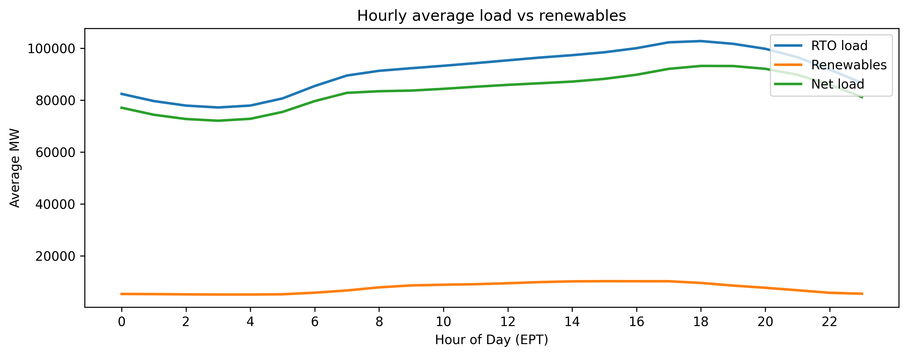
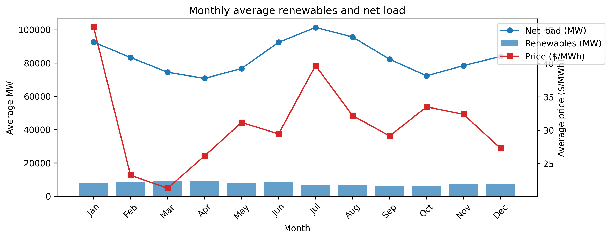
- The hourly overlay captures PJM’s duck curve: renewables shave midday net load yet evening ramps remain steep. Storage developers use these curves to size four-hour versus eight-hour batteries.
- Weekdays sit consistently above weekends because commercial demand rarely drops to residential levels. This gap explains why weekday congestion and uplift costs run higher.
- Monthly averages show renewable-rich shoulder seasons trimming net load and nudging prices lower, whereas winter heating season keeps both net load and price elevated when renewables underperform. Utilities lean on these cycles when planning maintenance or hedging fuel.

### Renewable Fuel Cyclicality
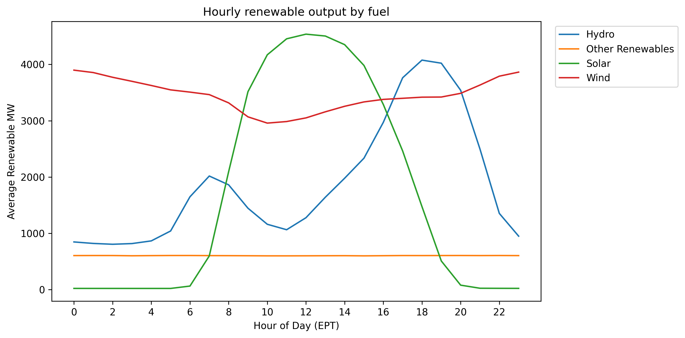
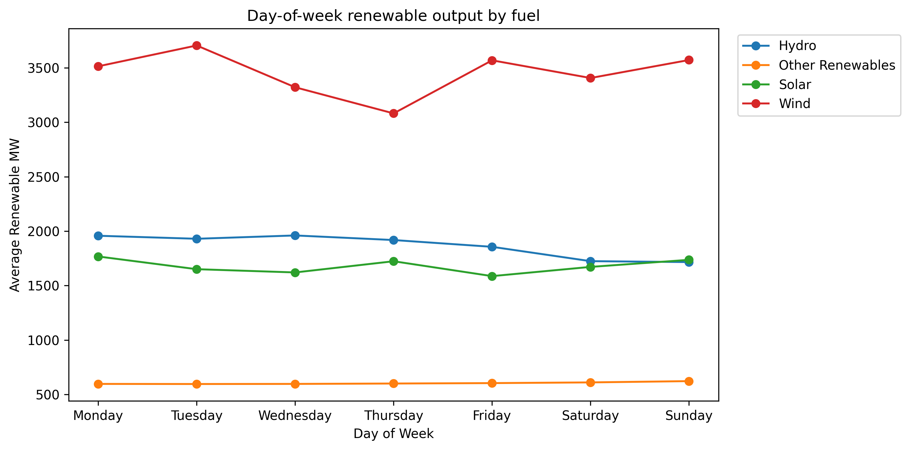
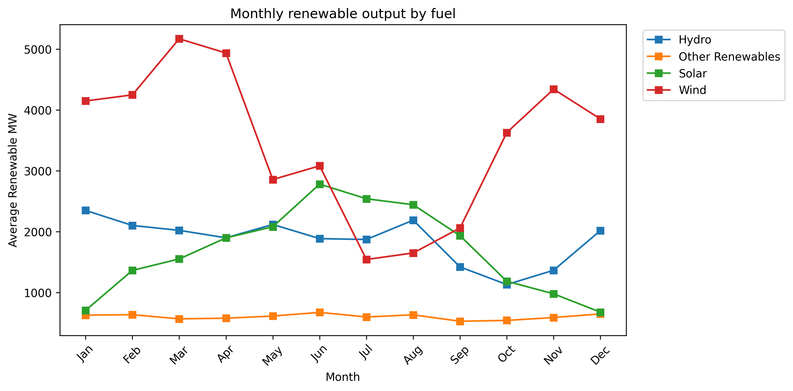
- Wind remains strong overnight and in spring or fall, explaining off-peak dips in net load that might otherwise appear mysterious. Grid operators watch these wind ramps when committing gas units.
- Solar creates the sharp midday spike, especially in summer. The speed of its morning ramp dictates how much spinning reserve PJM must carry and how steep evening ramps become.
- Hydro and other renewables deliver a flatter baseline, cushioning periods when wind or solar disappoint; in drought-prone basins this insurance layer disappears, tightening the system.

### Heatmaps
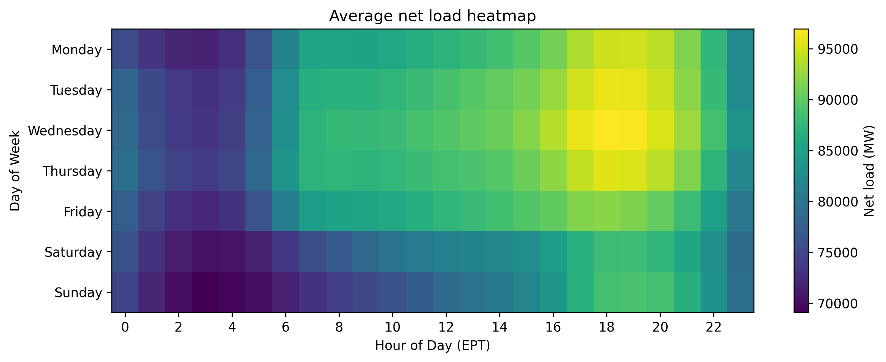
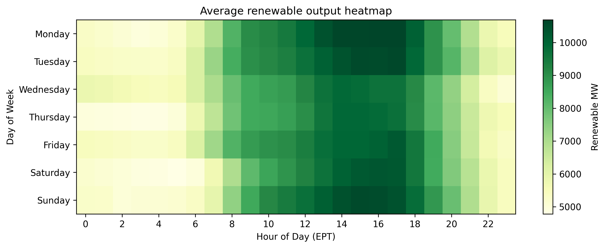
- Net load troughs before sunrise, particularly on weekends when commercial load pauses. These windows exhibit the highest risk of negative pricing if wind or solar surge.
- Daytime cells (0600–1800) show the highest net load, aligning with industrial and HVAC needs. Transmission planners use this pattern when stress-testing flows.
- Renewable output mirrors solar availability; midday relief is strongest in summer and weakest on winter mornings. Households on time-of-use tariffs indirectly experience this as lower daytime prices when renewables are plentiful.

### Net Load vs Price Density
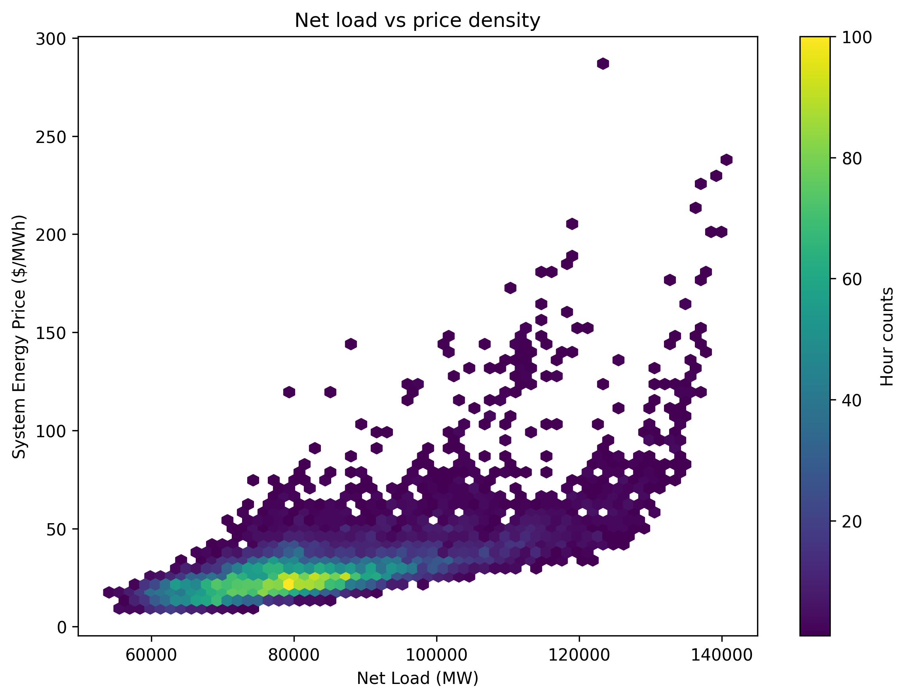
- The densest region sits around 95–110 GW and $20–40/MWh, defining PJM’s “normal” operation.
- Scarcity hours above 125 GW are rare yet carry outsized price impact.
- Low net-load bins (<80 GW) cluster in discounted price territory, illustrating how renewable oversupply forces prices lower and sometimes negative.

### Price vs Renewable Penetration
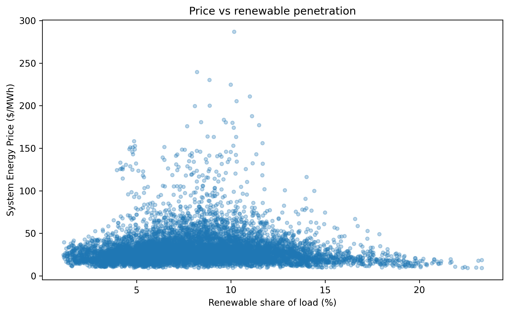

- Higher renewable share systematically suppresses PJM-RTO prices because fewer gas peakers clear. Consumers experience that suppression directly through cheaper energy charges.
- The curve is steepest when renewable share is low (below fifteen percent), then flattens as share increases, implying the first tranche of renewable deployment provides the largest marginal benefit to ratepayers and emissions targets.
- Generators still pursue renewables through tax credits, REC revenue, lower fuel-risk exposure, and improving capacity accreditation even if spot prices fall.

### Rolling Correlation
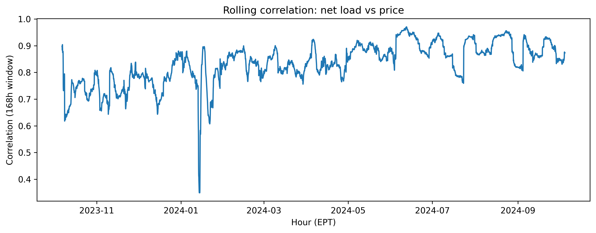
- Net load and price typically maintain correlation above 0.6.
- The January 2024 dip aligns with the EIA-documented Arctic outbreak that set a U.S. natural-gas demand record on 16 January; fuel scarcity temporarily broke the relationship.
- Correlation stabilises afterward, though late-2024 volatility keeps it from fully rebounding. This metric signals when fundamental models are trustworthy versus when traders must lean on fuel-market signals and outage reports.

### Net Load Trend, Volatility, and Scatter Diagnostics
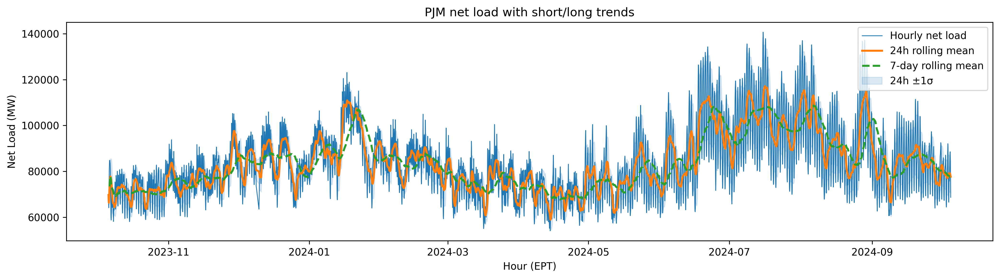
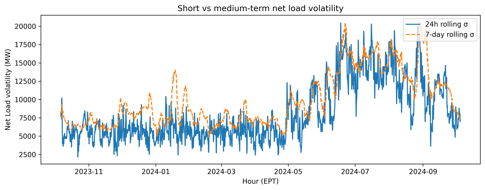
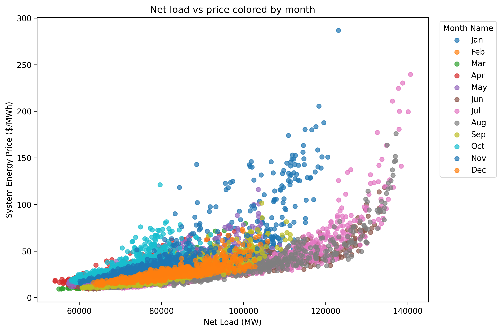
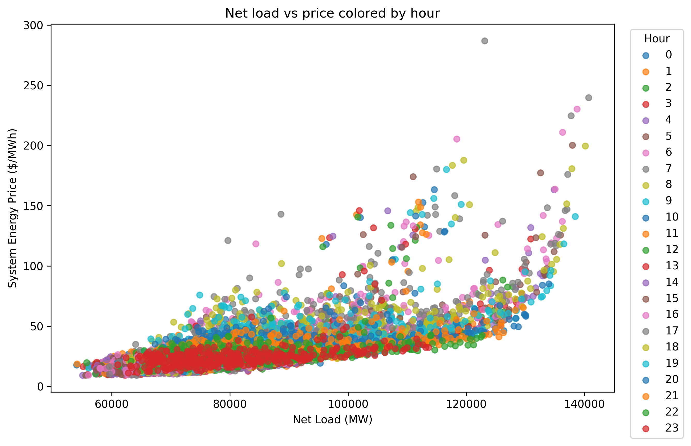
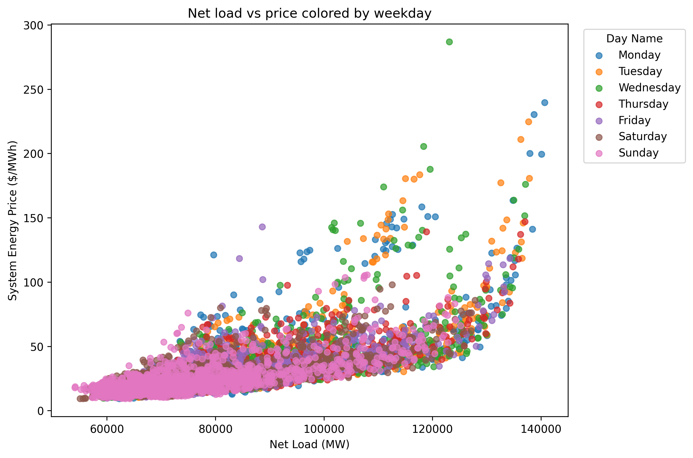
- Rolling means reveal intraday renewable troughs layered over seasonal swings. Utilities can see when load transfers from fossil units to renewables and schedule maintenance accordingly.
- Volatility spiked in January 2024 and remained elevated throughout the back half of 2024, mirroring weather-driven stress and uneven renewable availability. The volatility plot mirrors the operational turbulence described in PJM’s winter reliability notices.
- Month-coloured scatter shifts rightward in summer (higher base net load), hour-coloured scatter separates cheap midday vs pricey evening ramps, and weekday colouring shows weekdays dominating the upper-right quadrant. Each scatter speaks to a different operational reality that feeds directly into price formation.

### Binned Relationship and Distribution
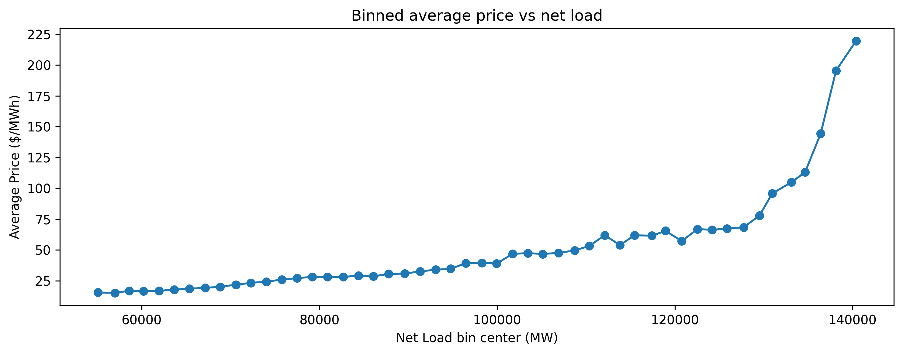
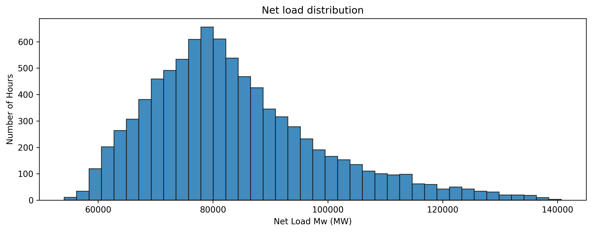
- Marginal price reaction accelerates sharply beyond roughly 125 GW net load, demonstrating PJM’s scarcity knee and explaining where demand-response providers target their events.
- Net load distribution is right-skewed; low-stress hours dominate counts, yet the thin high-load tail drives most price spikes. Insurance-like capacity products and peak-shaving investments are priced around that tail.

### Regression and Residual Analysis
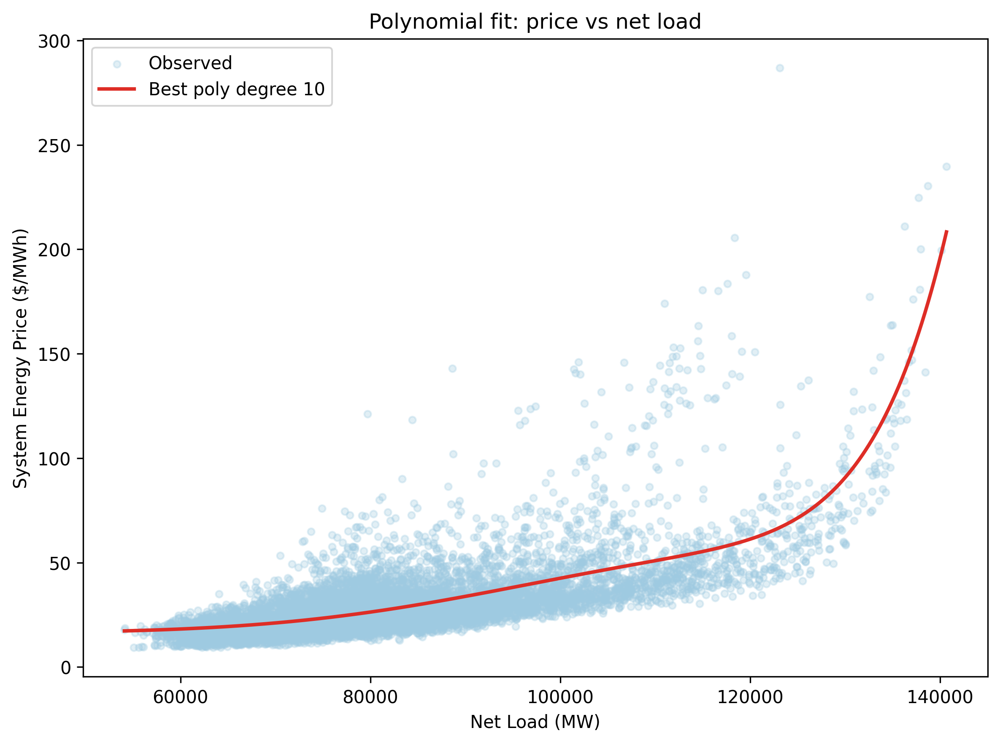
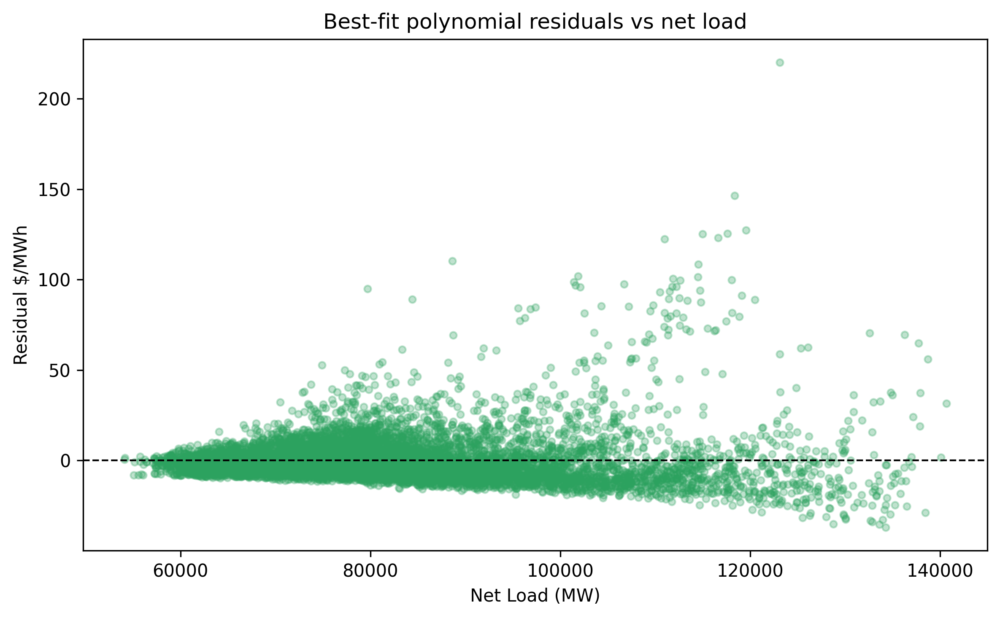
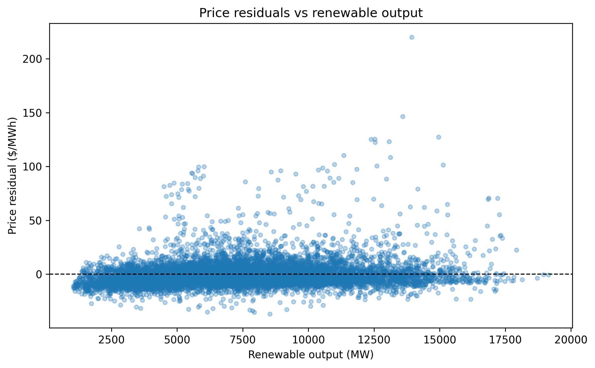
- Degree 10 polynomial best balances bias and variance, capturing the flat-to-steep curvature seen in empirical bins without overfitting the test set.
- Residuals cluster near zero but show positive spikes during scarcity events and negative spikes during renewable surges; these outliers correspond to headline events such as forced outages or surprise renewable production.
- Residuals plotted against renewable MW confirm that high renewable output depresses price more than a net-load-only model anticipates, which is why traders track renewable forecasts alongside load forecasts.

### Extreme Net-Load Events
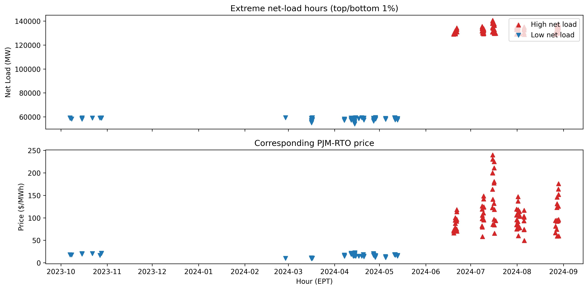
- High net-load events cluster around winter cold snaps and late-summer heat waves, with corresponding price spikes that feed into scarcity pricing and reserve deployments.
- Low net-load events occur during mild spring weekends, pairing low demand with strong renewables; these windows carry the highest risk of negative pricing and curtailment.
- The exported CSV lists each timestamp with its load, renewable MW, and price for deeper case studies.

### Autocorrelation
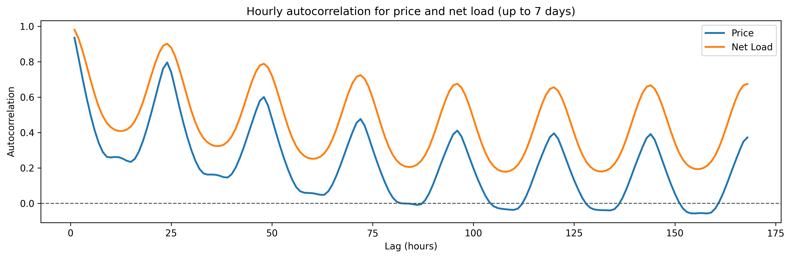
- Net load retains daily (about 24 h) and weekly (about 168 h) memory, guiding short-term forecast horizons for system operators and quantitative traders.
- Price autocorrelation decays faster, reflecting added noise from fuel prices, outages, and market interventions; beyond one day ahead, models must incorporate exogenous drivers rather than load alone.

---
This README doubles as the project report. For deeper detail, review the Markdown commentary embedded throughout `energy.ipynb`, which mirrors and expands upon the observations noted above. Re-running the notebook will regenerate all figures and CSVs to keep this document in sync with the latest data.
