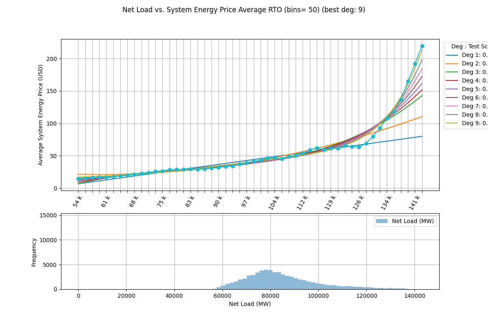

# CFT Energy Analysis

This repository contains the analysis and results of a cyclicality study of energy prices and net load in relation to fuel types, using historical data and various visualization techniques. The primary focus is on understanding the cyclic nature of energy prices and how different fuel types affect these prices on an hourly, daily, and monthly basis.

## Table of Contents
1. [Project Overview](#project-overview)
2. [Key Features](#key-features)
3. [Data Sources](#data-sources)
4. [Setup Instructions](#setup-instructions)
5. [Analysis Breakdown](#analysis-breakdown)
6. [Results](#results)
7. [Key Figures](#key-figures)

## Project Overview
The `CFT Energy Analysis` project aims to analyze the cyclicality of energy prices and their relationship with net load (load minus renewable generation), broken down into hourly, weekly, and monthly patterns. It uses data preparation, cyclicality analysis, and polynomial regression to identify patterns between energy prices and net load.

### Key Highlights:
- **Hourly, Daily, and Monthly Cyclicality:** Energy prices fluctuate based on demand patterns, with gas showing the highest cyclicality.
- **Net Load vs Energy Prices:** A regression analysis was performed to identify the relationship between net load and energy prices.

## Key Features
- **Cyclicality Analysis:**
  - Analyze the cyclicality of energy prices and net load on an hourly, weekly, and monthly basis.
  - Understand how fuel types like gas, coal, and nuclear behave throughout the day and seasons.
  
- **Net Load & Energy Price Relationship:**
  - Identify relationships between net load and energy prices using polynomial and exponential regression techniques.

- **Visualization:**
  - Clear plots showcasing net load, energy prices, and their relationships for easy interpretation.

## Data Sources
### **`df_generation_by_source`**:
- **fuel_type**: Type of fuel used for energy generation (e.g., 'Coal', 'Gas', 'Nuclear', etc.).
- **mw**: Amount of power generated in megawatts (MW).
- **fuel_percentage_of_total**: Percentage of total energy generated by each fuel type.
- **is_renewable**: Boolean indicating whether the fuel type is renewable.

### **`df_historical_power_load`**:
- **evaluated_at_utc**: Timestamp in UTC when the forecast was evaluated.
- **evaluated_at_ept**: Same as above, in Eastern Prevailing Time (EPT).
- **forecast_area**: Geographic area for which the energy load is being forecasted (e.g., AEP, APS, COMED, RTO).
- **forecast_load_mw**: Forecasted electrical load (demand) for the specified area in megawatts (MW).

### **`day_ahead_energy_price`**:
- **pnode_id**: Unique ID for the pricing node in the grid.
- **pnode_name**: Name or label associated with the PNode.
- **system_energy_price_da**: Day-ahead forecast of system-wide energy prices.
- **total_lmp_da**: Locational Marginal Price (LMP) including energy price, congestion costs, and marginal losses.

### **Net Load**:
- **net_load_mw**: The difference between total load and renewable generation (wind, solar, hydro).

## Setup Instructions
1. Clone this repository to your local machine.
   ```bash
   git clone https://github.com/your-username/cft-energy-analysis.git
   ```
2. Install the required dependencies:
   ```bash
   pip install -r requirements.txt
   ```
3. Run the Jupyter notebook to reproduce the results:
   ```bash
   jupyter notebook energy_analysis.ipynb
   ```

## Analysis Breakdown
1. **Hourly Cyclicality Analysis**:
   - The notebook analyzes energy price fluctuations throughout the day, showing that prices tend to be lowest in the early morning and highest in the late afternoon, reflecting daily demand cycles.
   
2. **Weekly Cyclicality**:
   - Energy price trends by day of the week show prices peaking on weekdays and declining towards the weekend due to varying demand.

3. **Monthly Cyclicality**:
   - Energy prices peak during months of extreme temperatures, such as in January (winter) and July (summer), indicating higher demand for heating and cooling.

4. **Net Load Analysis**:
   - The net load (total load minus renewable generation) is analyzed for its cyclicality and its relationship to energy prices, revealing demand patterns across different time periods.

5. **Regression Analysis**:
   - Polynomial and exponential regression models are applied to determine the best-fit relationship between net load and energy prices. Various degrees of polynomial regression (up to degree 5) are tested.

## Results
- **Fuel Type Cyclicality**: 
  - Gas shows the highest cyclicality, fluctuating throughout the day, while nuclear remains the most stable energy source.
  
- **Energy Price Cyclicality**: 
  - Prices are influenced by the time of day and season, peaking during high-demand periods.

- **Net Load vs Energy Price Regression**:
  - Polynomial regression is used to explore the complex relationship between net load and energy prices. Higher-order polynomial degrees are applied to capture nonlinearities in the data.

## Key Figures
- **Net Load vs Price by Region**: 


- **All Regions Net Load vs Price Regression**: 


- **NOT RTO Regions Net Load vs Energy Price Regression**:

  
- **RTO Region Net Load vs Energy Price Regression**:



---

This project showcases how energy prices and net load fluctuate based on time of day, season, and type of energy source used. By identifying cyclicality and relationships between these factors, we can better predict and respond to energy demand and price variations.